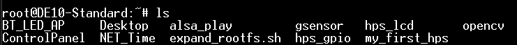
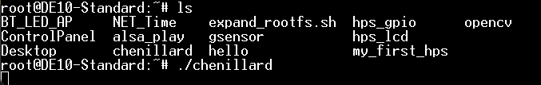

# TP_Linux

Preparation de la carte SD:

Preparation effectuee par M. Fiack sur Linux.

Preparation de l'environnement de developpement:

Installation d'ORACLE VM VirtualBox:


/!\ Ne pas oublier de changer le chemin d'accès pour ne pas se retrouver dans les dossiers partages de M.BARES:


Parametrer la connection ethernet de la carte pour la lier a notre VM:

On utilise TeraTerm lié en serial port pour visualier le Linux de notre carte.
Au demarage de la carte, avec la commande "ls" on a :


on entre la commande 
```C
vim /etc/network/interfaces
```
on supprime le contenu présent puis on écrit 
```C
auto eth0
iface eth0 inet dhcp
allow-hotplug eth0
```

Quand c’est terminé, on appui sur la touche Echap pour revenir en mode command
puis on entre la commande
```C
:wp
``` 
avant d'appuyer sur entrée pour sauvegarder et quitter vim.

suivi de la commande de redémarrage 
```C
sudo reboot
```

Après le reboot, on peut alors récupérer l'IP de la carte avec la commande:
```C
ip a
```


Une fois l'IP de la carte récupérée on peut l'utiliser pour envoyer les programmes developpes depuis notre VM vers la carte : 


Une fois le fichier Hello transféré, si on retappe la commande "ls" on obtient:


le fichier hello a bien été transféré, on peut l'exécuter sur la carte avec la commande TeraTerm
```C
./hello
```
Alors même que le fichier a été créé sur la VM:


# 1.4.4 Accès au matériel


Les commandes suivantes:
Allument la led1,
Eteignent la led1
Allument la led2
Allument la led1

# 1.4.5 Chenillard (Et oui, encore !)

On va créer un fichier Chenillard.c dans la VM:
```C
//il faut allumer puis supprimer les led1 à led9
#include <stdio.h>
#include <fcntl.h>
#include <sys/types.h>
#include <sys/stat.h>
#include <unistd.h>

int main (void)
{
    char filename[50];//Contient le chemin du fichier brightness des leds
    int fd[10];//Tableau de 10 chemins (un chemin pour chaque led de 1 à 9)
    int i;

    for (i=0;i<10;i++)
    {   //ouverture des fichiers brightness pour les leds 1 à 9
        sprintf(filename,"/sys/class/leds/fpga_led%d/brightness",i);
        fd[i] = open(filename,O_WRONLY);
    }
    

    while(1)
    {
        for(i=0;i<10;i++)
        {
            //allume en ecrivant "1" dans le fichier brightness
            write(fd[i],"1",1);
            usleep(100000);
        }
        for(i=0;i<10;i++)
        {
            //eteint en ecrivant "0" dans le fichier brightness
            write(fd[i],"0",1);
            usleep(100000);
        }
    }
    
}
```

Puis on charge le code dans notre VM et on l'envoi sur notre carte:


Sur TeraTerm (notre carte), on vérifie la présence du nouveau code et on le lance:


# 2  Modules kernel

# 2.1 Accès aux registres

On créé un chenillard en utilisant mmap:
```C
#include <stdio.h>
#include <sys/mman.h>
#include <sys/stat.h>
#include <sys/types.h>
#include <fcntl.h>
#include <stdint.h>
#include <unistd.h>


int main (void)
{
    uint32_t * p;
    int i;
    int fd = open("/dev/mem", O_RDWR);
    p = (uint32_t*)mmap(NULL, 4, PROT_WRITE|PROT_READ, MAP_SHARED,fd, 0xFF203000);
    //*p = (1<<9);//Allume la 8ieme led
    //*p = 8; //Allume (1000) la 4ieme led
    while(1)
    {
    for(i=1;i<10;i++)
    {
        *p=(1<<i);
        usleep(100000);
    }
    }

}
```

On met à jour le code sur la VM et on l'envoi sur le SOC:


Sur le SOC:


Pose 2 problèmes:

Pas de possibilité d'interruption.

Pas de portabilité (l'adresse est marquée en dure. Doit rechanger le code en dur si l'adresse change. Exemple : sur un autre appareil l'adresse des GPIO peut etre differente)

# 2.2 Compilation de module noyau sur la VM

Installation linux-headers-amd64:


Installation BC:


