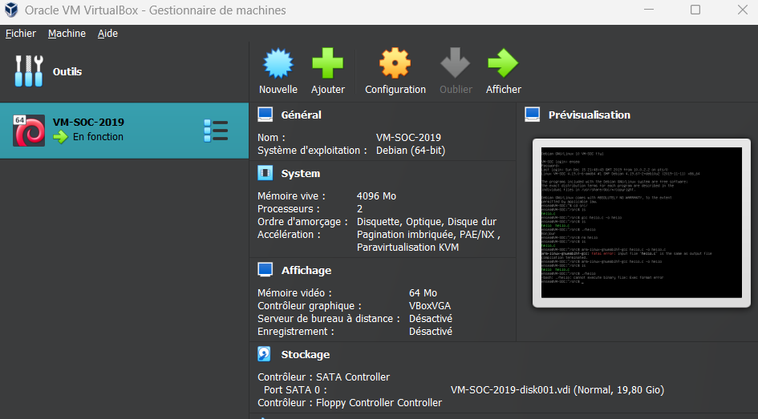

# TP_Linux

Preparation de la carte SD:

Preparation effectuee par M. Fiack sur Linux.

Preparation de l'environnement de developpement:

Installation d'ORACLE VM VirtualBox:


/!\ Ne pas oublier de changer le chemin d'accès pour ne pas se retrouver dans les dossiers partages de M.BARES:


Parametrer la connection ethernet de la carte pour la lier a notre VM:

On utilise TeraTerm lié en serial port pour visualier le Linux de notre carte.
Au demarage de la carte, avec la commande "ls" on a :


on entre la commande 
```C
vim /etc/network/interfaces
```
on supprime le contenu présent puis on écrit 
```C
auto eth0
iface eth0 inet dhcp
allow-hotplug eth0
```

suivi de la commande
```C
sudo reboot
```
On peut alors récupérer l'IP de la carte avec la commande:
```C
ip a
```


Une fois l'IP de la carte récupérée on peut la lier à notre VM:


Une fois le fichier Hello.c transféré, si on retappe la commande "ls" on obtient:


